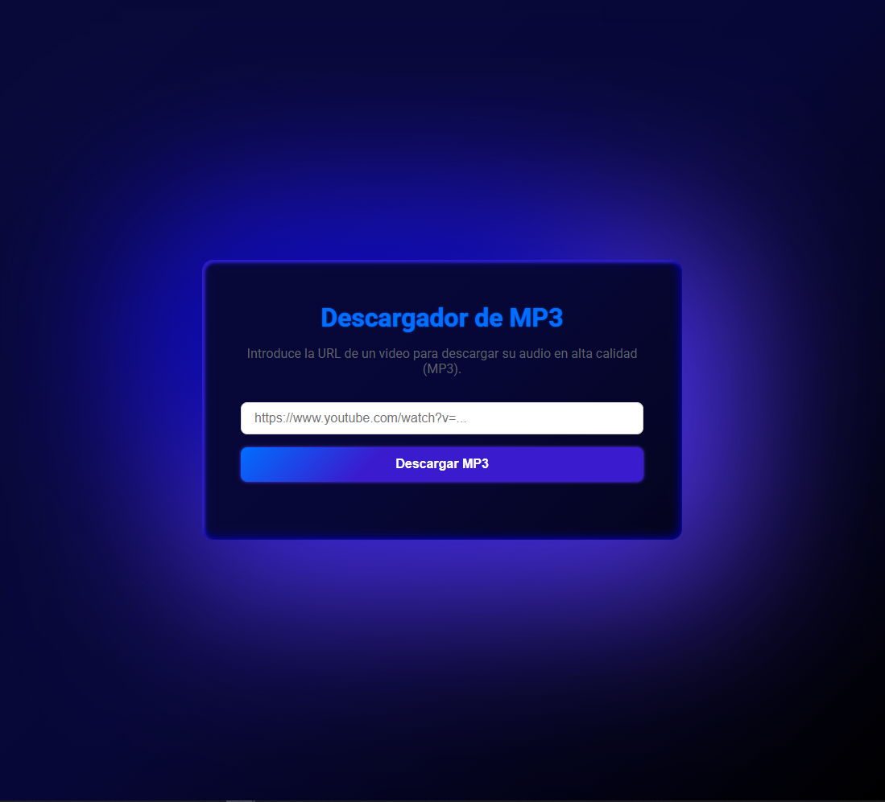

# 🎵 Descargador de MP3 con Python y Flask

Una aplicación web simple y elegante para descargar el audio de videos de YouTube (y otras plataformas compatibles) en formato MP3 de alta calidad, y poder escucharlo en cualquier lugar, momento y sin conexión, en modo _podcast_.


## ✨ Características

-   🚀 **Descarga Rápida**: Utiliza `yt-dlp` para una descarga y extracción de audio eficientes.
-   🎨 **Interfaz Moderna**: Diseño limpio y responsivo con HTML5 y CSS3.
-   📄 **Información del Video**: Muestra el título y la miniatura del video antes de descargar.
-   🏷️ **Nombres de Archivo Inteligentes**: Usa el título del video como nombre del archivo MP3 descargado.
-   🛡️ **Robusto**: Manejo de errores y limpieza de archivos temporales.

## 🛠️ Stack Tecnológico

-   **Backend**: Python 3.13+, Flask
-   **Herramienta de Descarga**: yt-dlp
-   **Conversión de Audio**: FFmpeg
-   **Frontend**: HTML5, CSS3, JavaScript (Vanilla)

## 📋 Prerrequisitos

Antes de ejecutar la aplicación, asegúrate de tener instalado:

1.  **Python 3.13 o superior**: [Descargar Python](https://www.python.org/downloads/)
2.  **FFmpeg**: Necesario para la conversión de audio.
    -   Descárgalo desde [ffmpeg.org](https://ffmpeg.org/download.html) (para Windows, elige la build de `gyan.dev`).
    -   Descomprime el archivo en una ubicación permanente (ej. `C:\ffmpeg`).
    -   **Importante**: La ruta a la carpeta `bin` de FFmpeg (ej. `C:\ffmpeg\bin`) debe ser conocida. La aplicación la usará internamente.

## 🚀 Instalación y Puesta en Marcha

Sigue estos pasos para tener la aplicación corriendo en tu máquina local.

### 💡 ¿Por qué usar un Entorno Virtual?

Es una **best practice** (buena práctica) esencial en Python. Aísla las dependencias de tu proyecto para evitar conflictos con otras aplicaciones y asegura que cualquiera que clone tu proyecto pueda replicar el entorno exacto.

1.  **Clona el repositorio**:
    ```bash
    git clone https://github.com/TU_USUARIO/TU_REPOSITORIO.git
    cd TU_REPOSITORIO
    ```

2.  **Crea y activa un entorno virtual** (Recomendado):
    ```bash
    python -m venv .venv
    # En Windows:
    .\.venv\Scripts\activate
    # En macOS/Linux:
    source .venv/bin/activate
    ```
    Verás que ahora tu terminal empieza con `(.venv)`, indicando que el entorno virtual está activo.

3.  **Instala las dependencias de Python**:
    ```bash
    pip install -r requirements.txt
    ```

4.  **Configura la ruta de FFmpeg**:
    -   Abre el archivo `app.py`.
    -   Localiza la línea `ffmpeg_path = r"C:\ffmpeg\bin"`.
    -   Asegúrate de que esta ruta apunta a la carpeta `bin` de tu instalación de FFmpeg.

5.  **Ejecuta la aplicación**:
    ```bash
    python app.py
    ```

6.  **Abre tu navegador** y ve a `http://127.0.0.1:5001`.

Para detener la aplicación, vuelve a la terminal y presiona `Ctrol+C`.

<br>

## 📁 Estructura del Proyecto

```
/mp3-downloader
├── app.py # Servidor Flask principal 
├── requirements.txt # Dependencias de Python
├── README.md # Este archivo
├── static/
│ ├── favicon.svg # Icono de la pestaña
│ └── style.css # Hoja de estilos
└── templates/
└── index.html # Interfaz de usuario
````


## ⚠️ Desafíos Técnicos Superados

Este proyecto fue un excelente ejercicio de resolución de problemas. Algunos de los desafíos clave fueron:

-   **Gestión de Entornos Python**: Asegurarse de que `yt-dlp` se ejecutara en el entorno virtual correcto.
-   **Integración con FFmpeg**: Resolver problemas de `PATH` y `ffprobe` para que `yt-dlp` y `subprocess` pudieran encontrar las herramientas de conversión de audio.
-   **Lógica de Descarga Robusta**: Implementar un proceso de dos pasos (descargar el audio original, luego convertir a MP3) para evitar la corrupción de archivos y errores de permisos en Windows.
-   **Comunicación Asíncrona**: Usar `fetch` en JavaScript para una experiencia de usuario fluida sin recargas de página.

## ⚖️ Aviso Legal

Esta herramienta es para fines educativos y personales. Por favor, úsala de manera responsable y solo para descargar contenido al que tengas derecho. No me hago responsable del uso que se le dé a la aplicación.

## 🤝 Contribuciones

¡Las contribuciones son bienvenidas! Si tienes una idea para mejorar el proyecto, no dudes en abrir un `issue` o enviar un `pull request`.

<div align="center">



</div>

